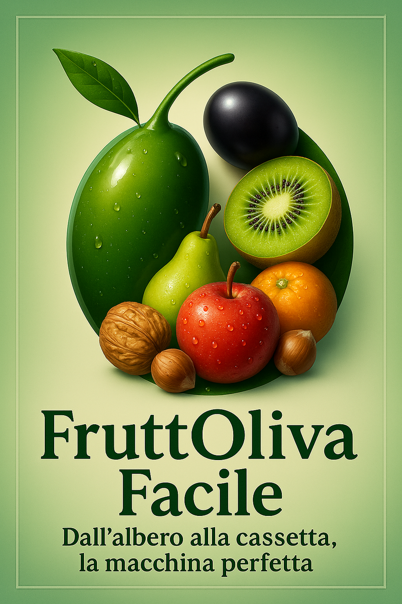

# FruttOliva Facile – Macchina raccogli olive e frutta pendula 

“ Macchina per la raccolta di olive e di frutta pendula disponibile in due versioni (V 1.0 e V 2.0) su Licenza Source-Available (SA-Commercial).”

<!-- Logo visibile sia in light che dark mode -->

  <!-- Logo per light mode -->
  <picture>
    <source media="(prefers-color-scheme: dark)" srcset="marketing/logo_scuro.png">
    <source media="(prefers-color-scheme: light)" srcset="marketing/logo_chiaro.png">
    
  </picture>

---

## 🇮🇹 Descrizione (Italiano)

La macchina raccoglie olive è un connubio tra Tradizione e Innovazione, un'evoluzione di un mio primo prototipo creato nel 2018

PUNTI DI FORZA:
* Studiata e provata in campo questa macchina ha la possibilità di essere utilizzata da un solo operatore per la leggerezza e la manovrabilità;
* È autosufficiente nell’incassettamento e blocca il fogliame;
* Costo relativamente basso grazie alle ricerche effettuate e all’idea rivoluzionaria che ho sviluppato;
* Un solo operatore per un appezzamento di terreno non estremamente sconnesso può raccogliere le olive di 100/120 alberi (o altra frutta secondo la versione della macchina), in pochissimo tempo con la minor fatica possibile:
* Non serve decespugliare il terreno sempre che l’erba non sia altissima;
* Non serve potare i polloni sulle radici;
* Non utilizza le reti di raccolta;
* Si può usare qualsiasi tipo di manina per la brucatura; consigliabile usare la nuova MANINA LEGGERA da me costruita ( Manina Dinamica V 3.0) senza alimentazione elettrica o ad aria per ottenere dell'olio extravergine pregiato;
* Si consiglia di tenere gli alberi ben potati a cono con le cascatelle di rami (a vaso pollonico) per spostare la produzione verso l’esterno della pianta.
* FruttOliva può essere spostata manualmente o trainata da un tagliaerba o trattorino;
* Può trasportare oltre i 150 kg di olive;
* E’ smontabile, facilmente riponibile in verticale occupando poco spazio e gli accessori sono inseribili nella base stessa;

PREGI E QUALITA' DEL RACCOLTO:
Questo sistema di raccolta evita:
* Di raccogliere olive già in fase di putrefazione;
* Di pestare le olive cadute sul terreno;
* Di spostare le olive raccolte direttamente al sito di racconta senza altri operatori;
* Anche in caso di pioggia si può continuare la raccolta.

Dopo due anni di prove faƩe sul campo su 120 alberi di olive la macchina è pronta, è il succo di
tuƩe le necessità di olivocoltori, che hanno oliveƟ in terreni umanamente accessibili e non molto sconessi o
in pendenza.
**FruttOliva Facile** è un prototipo di macchina **manuale e green** per la raccolta di olive e altri frutti pendenti.  
I frutti non toccano mai terra, cadono su una superficie ammortizzata e vengono subito incassettati.

### ⚙️ Caratteristiche principali
- Nessun motore → uso manuale, silenzioso, ecologico.  
- Cassette multiple integrate.  
- Sistema a molle regolabili per attutire la caduta.  
- Possibilità di ancoraggio con carrucole in terreni scoscesi.  
- Struttura modulare e adattabile a vari frutti (olive, mele, kiwi, prugne, pere, noci, nocciole).  

---

## 📂 Struttura del repository
- `/legal/` → licenza (LICENSE_FULL.docx) e marchio (TRADEMARK.docx)  
- `/marketing/` → logo e immagini  

---

## 🔑 Licenza
Questo progetto è distribuito sotto **Licenza Source-Available (SA-Commercial v1.0)**.  
I file CAD, i disegni tecnici e i manuali **non sono pubblici**.  
Per richiederli è necessario accettare la licenza e completare il pagamento.

👉 Compila questo modulo per richiedere i file:  
**[Modulo di richiesta licenza e download](https://docs.google.com/forms/d/e/1FAIpQLSfTbVVMwHI2QLadnsCA7LujxI0538x4_AsAecVl4cnVWzvgLw/viewform?usp=header)**

### 💰 Tariffe
- Privati: **100 €** → costruzione di **1 unità personale**.  
- Aziende/Professionisti: **400 € per ogni unità costruita**.  

### 📌 Modalità di pagamento
Bonifico bancario:  
IBAN: IT15W0760102400001016063081
Intestato a: Renato Maiorana
Banca: Poste Italiane

Ogni macchina deve riportare una **targhetta con ID licenza** rilasciato dall’autore.  

---

## 📅 Data certa
Il progetto è archiviato con **DOI Zenodo**:  
👉 [DOI da inserire dopo la release su Zenodo]  

---

## 📧 Contatti
- Autore: **Renato Maiorana**  
- Email ufficiale: **fruttolivafacile@gmail.com**  
- PEC: **renatomaiorana@pec.it**  

  

 

